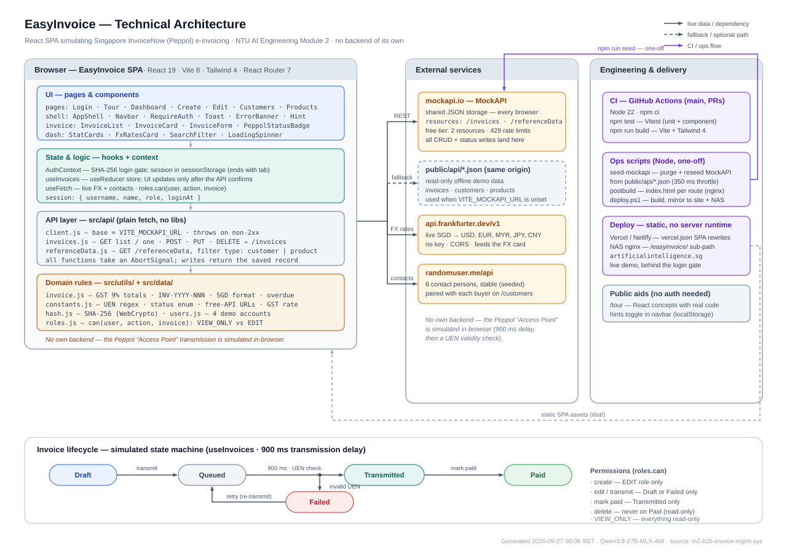

# EasyInvoice

EasyInvoice is a learning-focused React application for a small-business finance or accounts
receivable team. It demonstrates how users can create, find, edit, transmit, mark paid, and delete
B2B invoices while simulating Singapore's Peppol/InvoiceNow network.

This is an NTU AI Engineering Module 2 group project, not an accounting, tax, payment, or Peppol
production system.

- **Deployed application:** <https://aie1f-easyinvoice.vercel.app>
- **Assignment brief:** [`docs/requirements/module2-project-brief.pdf`](docs/requirements/module2-project-brief.pdf)
- **Architecture:** [`docs/engineering/architecture.md`](docs/engineering/architecture.md)

> Submission check: the URL above is the repository's recorded production URL. The team should
> verify it from a clean browser before submitting through NTU Blackboard.

## Screenshots

The assignment requires screenshots or a short recording of the working application. No verified
application screenshots are currently committed.

| Required evidence | Status |
|---|---|
| Dashboard and invoice list | **TODO:** add `docs/screenshots/dashboard.png` |
| Create-invoice form | **TODO:** add `docs/screenshots/create-invoice.png` |
| VIEW_ONLY versus EDIT permissions | **TODO:** add `docs/screenshots/role-comparison.png` |
| Successful persisted invoice change | **TODO:** add `docs/screenshots/persistence.png` or a recording link |

See [`docs/screenshots/README.md`](docs/screenshots/README.md) for the capture checklist and safe-data
guidance.

## Demo login

All accounts use the learning-project password `Password123`.

| Username | Role | Access |
|---|---|---|
| `viewer` | `VIEW_ONLY` | Read invoices and reference data |
| `john` | `EDIT` | Create and manage eligible invoices |
| `jennfang` | `EDIT` | Create and manage eligible invoices |
| `ralph` | `EDIT` | Create and manage eligible invoices |

The password hash and users are shipped in the browser bundle, and the session is stored in
`sessionStorage`. This is a demonstration gate, not authentication or authorization suitable for
real data.

## Implemented scope

| Area | Implemented behaviour |
|---|---|
| Authentication demo | Login/logout, protected routes, session restored within the browser tab |
| Invoice dashboard | Summary cards, list, empty/loading/error states, search, status filter |
| Invoice lifecycle | Create draft, edit Draft/Failed, simulated transmit, retry failure, mark Transmitted as Paid, delete non-Paid invoices |
| Invoice form | Controlled inputs, customer/product selection, multiple line items, 9% GST calculation, UEN/date/line validation, PayNow option flag |
| Roles | Central `can(user, action, invoice)` policy used by action controls and route guards |
| Persistence | MockAPI CRUD for shared invoices and reference data; read-only static JSON fallback |
| Reference views | Customer directory, product catalogue, live FX card, generated contact examples |
| Learning aids | Public Tour page and optional in-app React concept hints |
| Quality checks | 37 Vitest/React Testing Library tests and a GitHub Actions test/build workflow |
| Deployment | Vercel SPA deployment from `main`, with client-route rewrites |

Completed assignment bonus challenges include search/filtering, loading indicators, responsive
layouts, editing existing items, mock authentication, and automated React Testing Library tests.

## Deferred to future phases

- Maker-checker approval/rejection and a durable audit trail. The record reserves
  `pendingRequest`, but the current application always keeps it `null`.
- Real IRAS, InvoiceNow/Peppol Access Point, PayNow QR, email, or payment integration.
- Server-side authentication, authorization, validation, uniqueness constraints, and atomic
  workflow transitions.
- Customer/product administration, multi-company tenancy, PDF invoice generation, notifications,
  reporting, and reconciliation.
- Optimistic writes, conflict detection, pagination, drag-and-drop, and comprehensive accessibility,
  end-to-end, and route-guard test coverage.

The implemented/deferred boundary and demo limitations are detailed in
[`docs/product/scope-and-limitations.md`](docs/product/scope-and-limitations.md).

## Architecture



```text
Browser (React 19 + React Router)
    |
    +-- AuthContext: demo session
    +-- AppShell: shared invoice store and routes
    +-- useInvoices/useReducer: load and mutation state
            |
            +-- API client --> MockAPI
            |                  +-- /invoices
            |                  +-- /referenceData
            |
            +-- static JSON fallback (read-only)
    |
    +-- Frankfurter API: SGD exchange rates
    +-- randomuser.me: illustrative customer contacts
```

The browser owns the business rules and sends JSON directly to MockAPI. MockAPI supplies hosted
CRUD persistence and record IDs; it is not an authoritative schema validator. Record shapes,
state transitions, and the two-resource design are described in
[`docs/engineering/architecture.md`](docs/engineering/architecture.md).

## Constraints and limitations

EasyInvoice deliberately favours visible React concepts over production backend design:

- All business rules and credentials are client-side and can be bypassed.
- MockAPI has no application-specific authentication, authorization, transactions, or enforced
  record schema. Concurrent writes can overwrite one another.
- Invoice numbers are generated from the currently loaded list, so simultaneous users can produce
  duplicates.
- Transmission success is a local UEN-format check followed by a 900 ms delay; no external invoice
  is sent. PayNow is only a stored checkbox.
- Static fallback mode is read-only; live public APIs may fail or rate-limit independently.
- Test coverage is meaningful but incomplete, and CI currently has no lint, type-check,
  accessibility, security, or browser end-to-end gate.
- Vercel deployment is automatic, but there is no documented staging environment, database
  migration process, or automated rollback.

These constraints are intentional and make the project suitable for learning React, Vitest,
external API handling, and API persistence concepts without operating a custom backend.

## Run locally

### Prerequisites

- Node.js `20.19+` or `22.12+` (CI uses Node 22)
- npm

```bash
npm install
npm run dev       # http://localhost:5173/
npm test          # one-shot Vitest run
npm run build     # production build in dist/
npm run preview   # local production preview
```

If the project is stored in a cloud-synchronised folder and `npm install` fails with `EBADF`, copy
it to a local disk before installing dependencies.

Without environment configuration, the application loads the read-only demo records in
`public/api/`. Create, update, transmit, mark-paid, and delete actions require MockAPI.

### Optional MockAPI persistence

1. Create a MockAPI project containing `invoices` and `referenceData` resources.
2. Copy `.env.example` to `.env.local`.
3. Set `VITE_MOCKAPI_URL` to the project base URL, without a trailing slash or resource name.
4. Run `npm run seed` once. **Warning:** seeding purges both resources before recreating the demo
   records.
5. Start the app and confirm that a write made in one browser appears after loading another.

Do not commit `.env.local` or place real customer/invoice data in this demo service.

## Engineering design and deployment

- **Composition:** functional components and hooks; state is lifted into `AppShell`; Context is
  limited to authentication state.
- **Data boundary:** a small API layer owns HTTP and offline behaviour. Reducer state is updated
  only after a successful mutation, preventing false success after a failed write.
- **Permissions:** one policy function is reused by the UI and route handlers.
- **SPA hosting:** `vercel.json` rewrites application paths to `index.html`. `postbuild.mjs` also
  emits route folders for static hosts without rewrite support.
- **Team workflow:** feature branches, pull requests, review rotation, CODEOWNERS hints, and a PR
  checklist are documented in [`CONTRIBUTING.md`](CONTRIBUTING.md).

See [`docs/engineering/deployment.md`](docs/engineering/deployment.md) for environments, CI/CD,
configuration, release checks, rollback limitations, and software-engineering practices.

## CI/CD and tests

GitHub Actions runs the following on pushes to `main` and every pull request:

```text
npm ci -> npm test -> npm run build
```

Current verified baseline on 30 September 2026: **6 test files, 37 passing tests**, and a successful
Vite production build. Tests cover invoice calculations, IDs, roles, invoice API behaviour,
invoice-store failure semantics, invoice-card actions, and dashboard filtering/navigation.

Not yet covered: dedicated InvoiceForm interaction tests, create/edit route-guard tests,
Customers/Products pages, accessibility automation, and browser end-to-end tests. See
[`docs/engineering/testing.md`](docs/engineering/testing.md).

## Team contributions

The contribution summary below is based on the repository's commit history. It records delivered
work, not effort outside Git.

| Team member | Verified contribution |
|---|---|
| Ralph Koh | Built the initial InvoiceNow SG React/Vite prototype: routes, invoice UI/workflows, customer/product/tour pages, static data, styling, and the original deployment scripts. |
| Ang Jenn Fang | Introduced Vitest, jsdom, React Testing Library, user-event, test setup/scripts, and the first utility, hook, component, and page test suites. |
| John Phang | Developed the PRD and architecture; integrated MockAPI persistence, roles, API/store tests, seed tooling, CI and repository governance; led the EasyInvoice rename, framework upgrades, integration fixes, and engineering documentation. |

Detailed commit/PR evidence, assignment-role coverage, and placeholders for each member's personal
learning statement are in [`docs/team/contributions.md`](docs/team/contributions.md).

## Release and decision logs

- [`docs/releases/release-log.md`](docs/releases/release-log.md) - dated implementation and
  documentation milestones.
- [`docs/decisions/decisions-log.md`](docs/decisions/decisions-log.md) - product and engineering
  decisions, including the two-resource MockAPI design and deferred maker-checker scope.
- [`docs/planning/roadmap.md`](docs/planning/roadmap.md) - remaining submission work and future
  phases.

## AI and tools disclosure

The project records use of Claude.ai, Claude Code, and Cowork for requirements, planning,
scaffolding, debugging, and review; Qwen3.8-27B-MLX-4bit was used to generate architecture-diagram
variants. OpenAI Codex was used on 30 September 2026 to audit the assignment brief and repository
and restructure the documentation. Team members remain responsible for reviewing and explaining
the submitted code.

The supplied `mockup/singapore_invoicenow_app.html` informed the initial visual and interaction
direction. No other externally copied tutorial code is identified in the repository; if a team
member used another source, add its link here before submission.

## Documentation map

| Document | Purpose |
|---|---|
| [`docs/documentation-audit.md`](docs/documentation-audit.md) | Audit against the assignment brief and remaining evidence gaps |
| [`docs/product/scope-and-limitations.md`](docs/product/scope-and-limitations.md) | Implemented scope, deferred scope, constraints, and future phases |
| [`docs/engineering/architecture.md`](docs/engineering/architecture.md) | Runtime architecture, API/data model, state, roles, and auth |
| [`docs/engineering/deployment.md`](docs/engineering/deployment.md) | Deployment, CI/CD, configuration, release, and engineering controls |
| [`docs/engineering/testing.md`](docs/engineering/testing.md) | Test approach, coverage, conventions, and gaps |
| [`docs/team/contributions.md`](docs/team/contributions.md) | Team contributions and assignment collaboration evidence |
| [`docs/releases/release-log.md`](docs/releases/release-log.md) | Release history |
| [`docs/decisions/decisions-log.md`](docs/decisions/decisions-log.md) | Decision history |
| [`docs/screenshots/README.md`](docs/screenshots/README.md) | Screenshot/recording manifest and capture instructions |
| [`docs/requirements/PRD-B2B Invoice Management System-V1.md`](docs/requirements/PRD-B2B%20Invoice%20Management%20System-V1.md) | Product requirements and original decision register |
