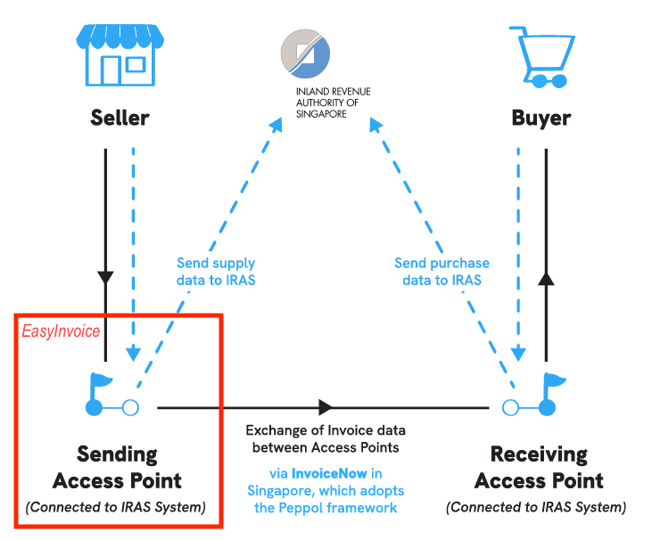

# EasyInvoice

Peppol in Singapore powers InvoiceNow, a nationwide e-invoicing network managed by the Infocomm Media Development Authority (IMDA) that allows businesses to send and receive structured digital invoices directly between accounting systems.

EasyInvoice demonstrates how users can create, find, edit, transmit, mark paid, and delete B2B invoices while simulating Singapore's Peppol/InvoiceNow network. 

This is a learning-focused React application for a small-business finance or accounts
receivable team, developed as an AI Engineering group project. It is not a production-grade application for accounting, tax, payment, or use in the real Peppol/InvoiceNow network.


## Purpose and audience

EasyInvoice demonstrates React application engineering through an invoice-management domain. The demo user is a representative example of a small-business finance or accounts receivable team member. 

The intended audience is the project team, learners in the course and course assessors.

It is not intended for real invoices, customers, tax reporting, Peppol transmission, or payment
processing.

### Peppol-InvoiceNow Business Process




## Deployed URL and Code Repository

- **Deployed application:** <https://aie1f-easyinvoice.vercel.app>
- **Github:** <https://github.com/NTU-AIE1F-Team6/m2-b2b-invoice-mgmt-sys>


## Constraints and Limitations

As a learning demonstration, EasyInvoice deliberately favours visible React concepts over production backend design:

- All business rules and credentials are client-side and can be bypassed.
- MockAPI has no application-specific authentication, authorization, transactions, or enforced
  record schema. Concurrent writes can overwrite one another.
- Invoice numbers are generated from the currently loaded list, so simultaneous users can produce
  duplicates.
- Transmission success is a local UEN-format check followed by a 900 ms delay; no external invoice
  is sent. PayNow is only a stored checkbox.
- Static fallback mode is read-only; live public APIs may fail or rate-limit independently.
- Test coverage is meaningful but not comprehensive.
- Vercel deployment is automatic, but there is no documented staging environment, database
  migration process, or automated rollback.

These constraints are intentional and make the project suitable for learning React, Vitest,
external API handling, and API persistence concepts without operating a custom backend.

See [Product scope, constraints, and limitations](docs/requirements/scope-and-limitations.md) for the full implemented scope, deferred phases, design trade-offs, and operational limitations.


## Screenshots

Selected screenshots as required. 

| Description | Screenshot |
|---|---|
| Dashboard and invoice list, data persistence via mockapi | [`docs/images/dashboard.png`](docs/images/dashboard.png) |
| Create invoice form | [`docs/images/create-invoice.png`](docs/images/create-invoice.png) |
| Mockapi Reference Data:`customers` | [`docs/images/referenceData-customers.png`](docs/images/referenceData-customers.png) |
| Mockapi Reference Data:`products` | [`docs/images/referenceData-products.png`](docs/images/referenceData-products.png) |
| Hints: ON | [`docs/images/Hints-ON.png`](docs/images/Hints-ON.png) |
| Full Tour with code snippets  | [`docs/images/Full_tour_with_code.png`](docs/images/Full_tour_with_code.png) |


## Demo login

All accounts use the learning-project password `Password123`.

***This is a demonstration gate, not authentication or authorization suitable for
real data.***

| Username | Role | Access |
|---|---|---|
| `viewer` | `VIEW_ONLY` | Read invoices and reference data |
| `john` | `EDIT` | Create and manage eligible invoices |
| `jennfang` | `EDIT` | Create and manage eligible invoices |
| `ralph` | `EDIT` | Create and manage eligible invoices |

The password hash and users are shipped in the browser bundle, and the session is local to browser. 


## Implemented scope

| Area | Implemented behaviour |
|---|---|
| Authentication demo | Login/logout, protected routes, session restored within the browser tab |
| Invoice dashboard | Summary cards, list, empty/loading/error states, search, status filter |
| Invoice lifecycle | Create draft, edit Draft/Failed, simulated transmit, retry failure, mark Transmitted as Paid, delete non-Paid invoices |
| Invoice form | Controlled inputs, customer/product selection, multiple line items, 9% GST calculation, UEN/date/line validation, PayNow option flag |
| Roles | Central `can(user, action, invoice)` policy used by action controls and route guards |
| Persistence | MockAPI CRUD for shared invoices and reference data; read-only static JSON fallback |
| Reference views | Customer directory, product catalogue, live FX card, generated contact examples |
| Learning aids | Public Tour page and optional in-app React concept hints ([`docs/engineering/Hints.md`](docs/engineering/Hints.md)).|
| Quality checks | 37 Vitest/React Testing Library tests and a GitHub Actions test/build workflow |
| Deployment | Vercel SPA deployment from `main`, with client-route rewrites |

Completed assignment bonus challenges include search/filtering, loading indicators, responsive
layouts, editing existing items, mock authentication, and automated React Testing Library tests.


## Documentation Map
| #   | Name | Document | Remarks |
| --: |---|---|---|
| 1. | EasyInvoice architecture diagram | [docs/engineering/easyinvoice-architecture.svg](docs/engineering/easyinvoice-architecture.svg) | |
| 2. | Application Architecture and Design | [docs/engineering/architecture-design.md](docs/engineering/architecture-design.md) | React routing, component composition, data fetching, Tech Stack, API schema, App Design, etc. |
| 3. | Testing | [docs/engineering/testing.md](docs/engineering/testing.md) | The suite uses Vitest 5, React Testing Library, @testing-library/jest-dom, @testing-library/user-event, and jsdom. GitHub Actions runs npm ci, npm test, and npm run build on every pull request and push to main. |
| 4. | Deployment | [docs/engineering/deployment.md](docs/engineering/deployment.md) | Environments, CI/CD, configuration, release checks, rollback limitations, and software-engineering practices. |
| 5. | Hints On/Off rendering | [docs/engineering/Hints.md](docs/engineering/Hints.md) | Every component defines their hint text. CSS renders or hides every .react-hint descendant based on Hints button toggle. |
| 6. | Implemented scope, contraints and limitations | [`docs/requirements/scope-and-limitations.md`](docs/requirements/scope-and-limitations.md) | Implemented scope, deferred scope, constraints, and future phases |
| 7. | Team member contributions | [`docs/team/contributions.md`](docs/team/contributions.md) | Team contributions and assignment collaboration evidence |
| 8. | Release log | [`docs/releases/release-log.md`](docs/releases/release-log.md) | Release history |
| 9. | Decisions log | [`docs/decisions/decisions-log.md`](docs/decisions/decisions-log.md) | Decision history |
| 10.| Product Requirements Document (PRD) | [`docs/requirements/PRD-B2B Invoice Management System-V1.md`](docs/requirements/PRD-B2B%20Invoice%20Management%20System-V1.md) | Product requirements and original decision register |


## CI/CD and tests

GitHub Actions runs the following on pushes to `main` and every pull request:

```text
npm ci -> npm test -> npm run build
```


## Run locally

### Prerequisites

- Node.js `20.19+` or `22.12+` (CI uses Node 22)
- npm

```bash
npm install
npm run dev       # http://localhost:5173/
npm test          # one-shot Vitest run
npm run build     # production build in dist/
npm run preview   # local production preview
```

If the project is stored in a cloud-synchronised folder and `npm install` fails with `EBADF`, copy
it to a local disk before installing dependencies.

Without environment configuration, the application loads the read-only demo records in
`public/api/`. Create, update, transmit, mark-paid, and delete actions require MockAPI.

### Optional MockAPI persistence

1. Create a MockAPI project containing `invoices` and `referenceData` resources.
2. Copy `.env.example` to `.env.local`.
3. Set `VITE_MOCKAPI_URL` to the project base URL, without a trailing slash or resource name.
4. Run `npm run seed` once. **Warning:** seeding purges both resources before recreating the demo
   records.
5. Start the app and confirm that a write made in one browser appears after loading another.

Do not commit `.env.local` or place real customer/invoice data in this demo service.


## Team contributions


| Team member | Contribution |
|---|---|
| Ralph Koh Kwan Liang | Built the initial InvoiceNow SG React/Vite prototype: routes, invoice UI/workflows, customer/product/tour pages, static data, styling, and the original deployment scripts. |
| Ang Jenn Fang | Proposed Peppol-InvoiceNow topic using html mockup. Coded Vitest, jsdom, React Testing Library, user-event, test setup/scripts, and the first utility, hook, component, and page test suites. |
| John Phang | Developed the PRD and architecture; integrated MockAPI persistence, roles, API/store tests, seed tooling, CI and repository governance; led the EasyInvoice rename, framework upgrades, integration fixes, and engineering documentation. |

Detailed commit/PR evidence, assignment-role coverage, and placeholders for each member's personal
learning statement are in [`docs/team/contributions.md`](docs/team/contributions.md).

## AI and tools disclosure

The project records use of Claude.ai, Claude Code, and Cowork for requirements, planning,
scaffolding, debugging, and review; Qwen3.8-27B was used to generate architecture-diagram
variants. OpenAI Codex was used to audit the assignment brief and repository
and restructure the documentation. Team members remain responsible for reviewing and explaining
the submitted code.

The supplied `mockup/singapore_invoicenow_app.html` informed the initial visual and interaction
direction. No other externally copied tutorial code is identified in the repository; if a team
member used another source, add its link here before submission.

